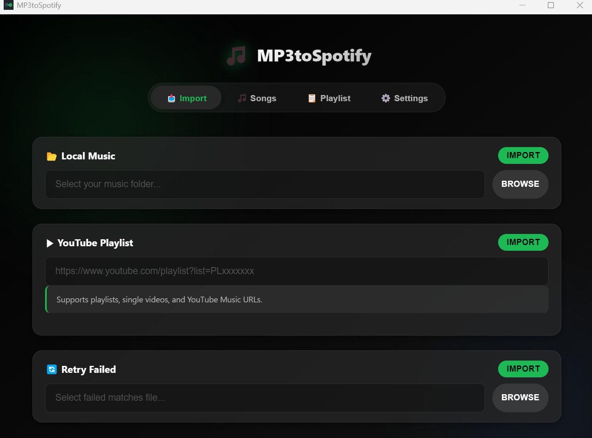
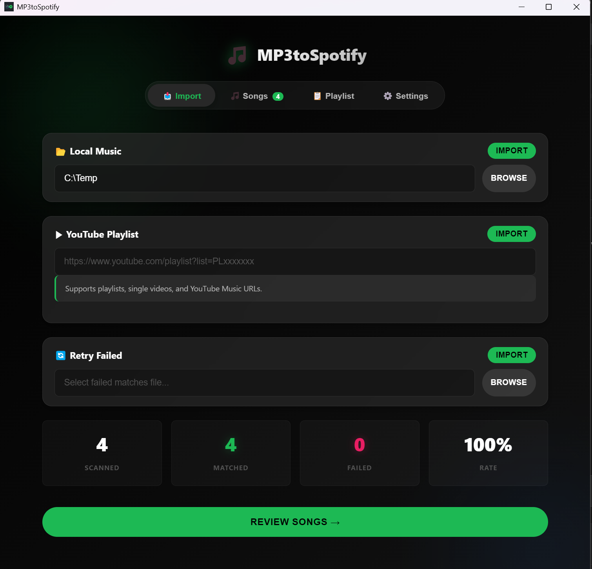
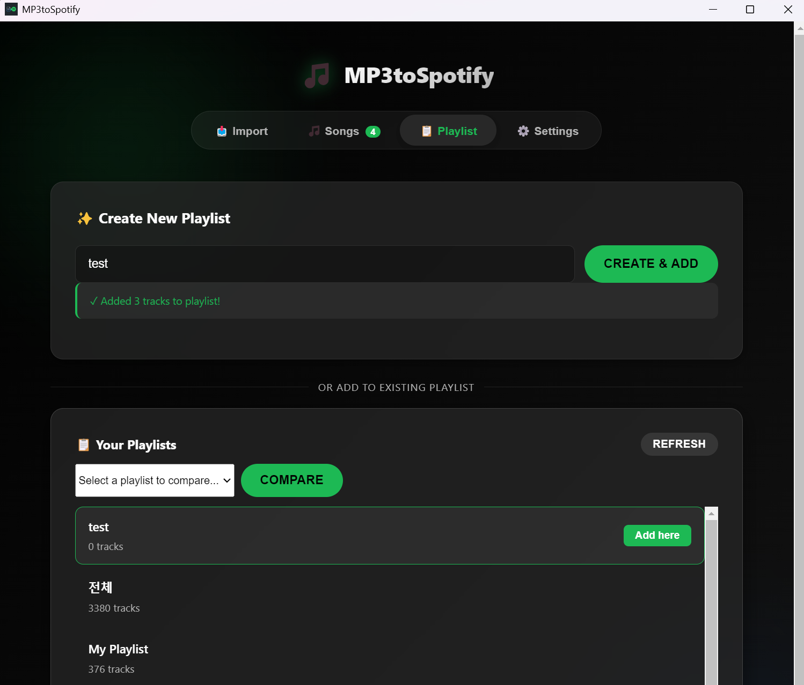
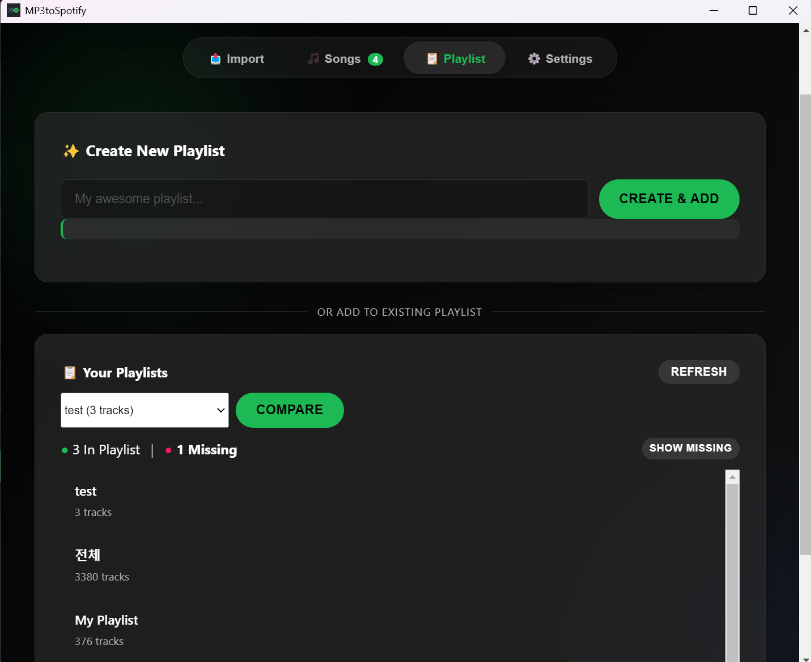

# MP3toSpotify

[](https://github.com/Topasm/MP3toSpotify/actions/workflows/release.yml)

> **🌐 Language / 언어:** **English** · [한국어](README.ko.md)

**The Ultimate Music Migration Tool.**

Effortlessly sync your **Local Music Library** and **YouTube Playlists** to Spotify.  
Use **Compare Mode** to find missing tracks in your playlists and fill the gaps instantly.  
Available as a modern **Desktop App** (Windows / macOS / Linux) and **CLI**.


**Key Features:**
- 🖥️ Modern desktop GUI (Electron) with real-time progress
- 🎵 Recursive local music directory scanning via TinyTag
- ▶️ YouTube playlist import (via yt-dlp — no download required)
- 🔍 Smart Spotify search with multiple fallback strategies
- 🔄 Retry failed matches with bracket/feat. removal, title-only search
- ☑️ Checkbox-based track selection — choose which songs to add to your playlist
- 📋 Browse & select existing Spotify playlists — no need to manually copy playlist IDs
- 🆕 Create New Spotfy Playlists directly within the app
- 🔀 Automatic duplicate detection (by track ID and display name)
- 🌏 Automatic encoding recovery (CJK mojibake fix via chardet)
- 📦 Standalone builds — no Python installation required

**Supported Audio Formats:**
MP3, FLAC, OGG, Opus, WMA, WAV, M4A, AAC, AIFF, DSF, WavPack

---

## Download

**➡️ [Latest Release](https://github.com/Topasm/MP3toSpotify/releases/latest)**

| Platform | File | Notes |
|----------|------|-------|
| **Windows** | `MP3toSpotify-*.exe` | Portable (no install) |
| **macOS** | `MP3toSpotify-*.dmg` | Drag to Applications |
| **Linux** | `MP3toSpotify-*.AppImage` | `chmod +x` then run |

> **No Python or Node.js installation required** — everything is bundled.

---

## How to Use

### 1. Get Spotify API Credentials

1. Go to [Spotify Developer Dashboard](https://developer.spotify.com/dashboard)
2. Click **Create an App**
3. Set **Redirect URI** to `http://127.0.0.1:8080`
4. Copy your **Client ID** and **Client Secret**

### 2. Launch & Configure

1. Download and open the app
2. Go to the **Settings** tab
3. Enter your **Client ID**, **Client Secret**, and **Spotify username**
4. Click **Save Settings**

### 3. Match Your Music



| Section | What it does |
|---------|-------------|
| **Local Music** | Select a local music folder → scans files → matches to Spotify |
| **YouTube Playlist** | Paste a YouTube playlist URL → matches to Spotify |
| **Retry Failed** | Retry unmatched songs with smarter search strategies |

**Step by step:**
1. Go to the **Import** tab.
2. Choose your source:
   - **Local Music**: Click "Browse" to select a folder, then "Import".
   - **YouTube**: Paste a URL and click "Import".
   - **Retry**: Select a failed matches file and click "Import".
3. Watch real-time progress on the dashboard (Scanned / Matched / Failed).
4. When finished, click the green **"Review Songs"** button.



5. Use **checkboxes** to pick which songs to add.
6. Click **"Add to Playlist"**.
7. You can **Create a New Playlist** directly or select an existing one.



**Tips:**
- Filter results — view All, Matched only, or Failed only
- Select All / Deselect All toggle
- Duplicate tracks are automatically skipped


### 4. Compare Mode

Compare your local music files with an existing Spotify playlist to easily add missing tracks.



1. Go to the **Playlist** tab.
2. Select a target playlist from the dropdown.
3. Click **Compare**.
4. Review the results:
   - Tracks already in the playlist are marked **"In Playlist"** and automatically unchecked.
   - Missing tracks are marked **"Missing"** and remain checked.
5. Click **"Show Missing"** to filter the list.
6. Click **"Add to Playlist"** to add only the new tracks. 
---

## CLI Usage

If you prefer the command line (requires Python — see [Developer Setup](#developer-setup) below):

```bash
# Scan local files
python backend/main.py <username> -d "C:/Music"

# Retry failed matches
python backend/retry_failed.py <username>

# Import YouTube playlist
python backend/youtube_import.py <username> -u "https://www.youtube.com/playlist?list=PLxxx"
```

<details>
<summary>CLI options reference</summary>

**Scan & Match:**

| Option | Description |
|---|---|
| `-d, --music-dir` | Path to your music directory |
| `-p, --playlist-id` | Add to an existing playlist (optional) |
| `-o, --output` | Failed matches output file (default: `failed_matches.txt`) |

**Retry Failed:**

| Option | Description |
|---|---|
| `-i, --input` | Failed matches file to retry (default: `failed_matches.txt`) |
| `-p, --playlist-id` | Add to an existing playlist (optional) |
| `-o, --output` | Still-failed output file (default: `still_failed.txt`) |

**YouTube Import:**

| Option | Description |
|---|---|
| `-u, --url` | YouTube playlist or video URL **(required)** |
| `-p, --playlist-id` | Add to an existing Spotify playlist (optional) |
| `-o, --output` | Unmatched songs output file (default: `yt_failed_matches.txt`) |

</details>

### Find Your Spotify Username

Your username can be found at [Spotify Account Overview](https://www.spotify.com/account/overview/) or by copying your **Spotify URI** (right-click your profile → Share → Copy Spotify URI).

---

## Developer Setup

> Only needed if you want to run from source or contribute. Regular users should use the [downloads above](#download).

### Prerequisites

- **Python 3.10+**
- **Node.js 18+** (for GUI only)

### Install

```bash
git clone https://github.com/Topasm/MP3toSpotify.git
cd MP3toSpotify

# Python dependencies
pip install -r backend/requirements.txt

# Electron GUI (optional)
npm install
```

### Configure Credentials

```bash
cp .env.example .env
```

Edit `.env`:

```
SPOTIPY_CLIENT_ID=your_client_id_here
SPOTIPY_CLIENT_SECRET=your_client_secret_here
```

> The GUI app also has a Settings tab for entering credentials directly.

### Run

```bash
npm start           # GUI app
cd backend && python main.py <username> -d "C:/Music"  # CLI
```

### Build Standalone Executable

```bash
cd backend
pip install pyinstaller
pyinstaller mp3tospotify.spec
# Output: backend/dist/mp3tospotify[.exe]
```

### Project Structure

```
MP3toSpotify/
├── .github/workflows/
│   └── release.yml            # CI: auto-build Win/Mac/Linux on tag push
├── electron/                  # Electron desktop app
│   ├── main.js                # Main process (window, IPC, subprocess)
│   ├── preload.js             # Secure IPC bridge
│   └── renderer/
│       ├── index.html         # UI layout
│       ├── styles.css         # Dark theme styling
│       └── app.js             # Frontend logic
├── backend/                   # Python core
│   ├── cli.py                 # Unified entry point (PyInstaller)
│   ├── main.py                # Scan local files → Spotify match
│   ├── retry_failed.py        # Retry with advanced search
│   ├── youtube_import.py      # YouTube → Spotify import
│   ├── spotify_client.py      # SpotifyClient (API wrapper)
│   ├── encoding_utils.py      # Mojibake recovery (chardet)
│   ├── gui_utils.py           # GUI output helper
│   ├── search_strategies.py   # Search fallback logic
│   ├── mp3tospotify.spec      # PyInstaller build spec
│   └── requirements.txt       # Python dependencies
├── .env.example               # Credential template
├── package.json
└── LICENSE                    # GPLv3
```


---

> Originally forked from [BoscoDomingo/SpotifyMatcher](https://github.com/BoscoDomingo/SpotifyMatcher). Licensed under [GPLv3](LICENSE).
